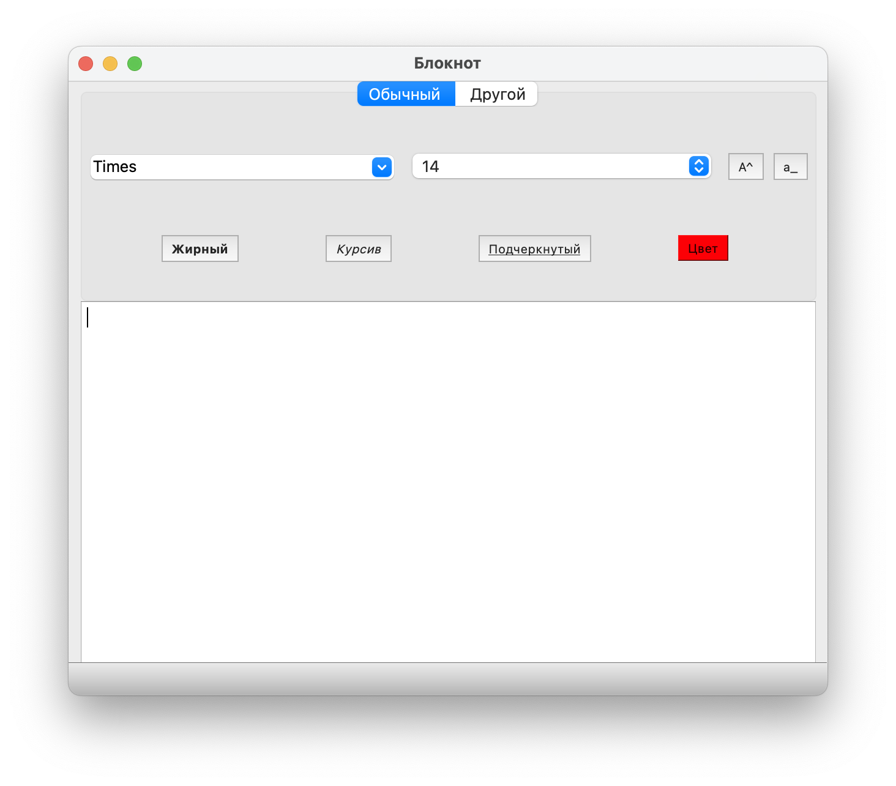

# Блокнот
Простое приложение для заметок на PyQT5.

# Функционал
Приложение умеет:
1. Работать со шрифтами (Начертание, тип шрифта, размер, цвет)
2. Сохранять и открывать файлы в формате txt.
# Инструкция для опытных программистов
Скачайте зависимости и запускайте notepad.py
# Подробная инструкция запуска
1. Скачайте репозиторий
2. Перейдите в каталог проекта:
    ```bash
    cd /путь/к/каталогу/
    ```
3. Запустите виртуальное пространство:
    ```bash
    python3 -m venv venv
    source venv/bin/activate
    ```
4. Скачайте зависимости:
    ```bash
   pip install -r requirements.txt
    ```
5. Запустите проект:
    ```bash
   python3 notepad.py
    ```
6. Для завершения программы закройте окно программы.
7. После завершения работы с проектом, деактивируйте виртуальное пространство:
   ```bash
    deactivate
    ```
